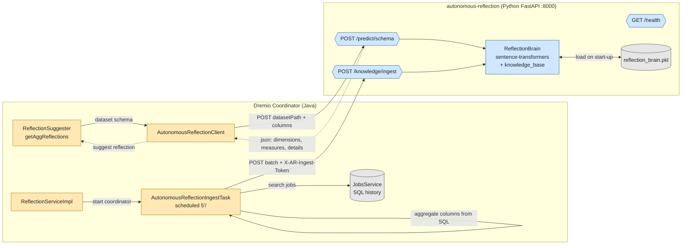
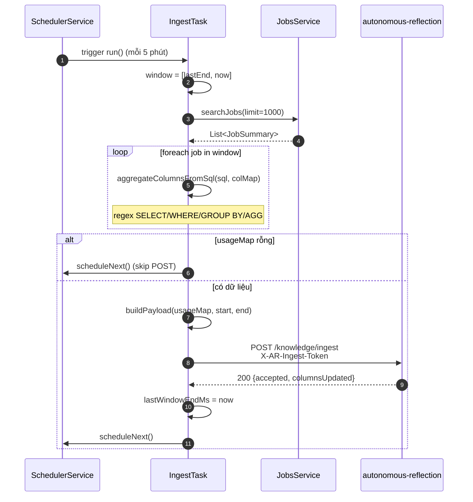

# Báo cáo: Tính năng Autonomous Reflection

Tài liệu trình bày phần **Autonomous Reflection** — module AI tự động đề xuất `dimension` / `measure` cho **Dremio Reflection** (kỹ thuật tăng tốc query của Dremio).

> **Vị trí trong dự án:** `services/autonomous-reflection/` (Python microservice) + `services/accelerator/.../analysis/` (Java client tích hợp vào Dremio coordinator). Đây **không phải** thư mục `tools/autonomous-reflection` — repo không có folder đó.

---

## 1. Bối cảnh: Dremio Reflection là gì?

**Reflection** trong Dremio là một dạng *materialized view* được Dremio tự động sử dụng khi planner phát hiện query có thể "nuốt" qua reflection thay vì quét bảng gốc → **tăng tốc 10-100×**.

Một reflection cần được khai báo:

- **Dimension fields** — cột phân nhóm (tương đương `GROUP BY`).
- **Measure fields** — cột tổng hợp (tương đương `SUM`, `AVG`, `COUNT`, …).

**Vấn đề:** với bảng có hàng trăm cột, người dùng phải tự đoán cột nào là dimension / measure → **chậm và dễ sai**.

**Giải pháp Autonomous Reflection:** một **AI service** tự gán nhãn dimension/measure dựa trên:

1. **Tên cột** (`customer_id` thường là dimension; `total_revenue` thường là measure) — dùng **semantic similarity** (sentence-transformers).
2. **Cách cột được dùng trong các query đã chạy** (job history) — phản hồi học liên tục.

---

## 2. Kiến trúc tổng thể



Hai luồng song song:

| Luồng | Hướng | Mục đích |
|-------|-------|----------|
| **Inference (đề xuất)** | Java → Python `POST /predict/schema` | Khi tạo reflection mới, lấy gợi ý dimension/measure |
| **Ingest (học)** | Java → Python `POST /knowledge/ingest` | Mỗi 5 phút, gửi thống kê cột-từ-query đã chạy để service "học" |

---

## 3. Cấu trúc thư mục

```text
services/autonomous-reflection/                # Python FastAPI service
├── main.py                  # FastAPI app, ReflectionBrain, 3 endpoint
├── ingest_models.py         # Pydantic IngestRequest / IngestResponse
├── ingest_service.py        # Logic apply ingest, idempotency theo batchId
├── requirements.txt         # FastAPI, sentence-transformers, joblib...
├── README.md                # Hướng dẫn API + cài đặt
├── DEPLOYMENT.md            # Hướng dẫn triển khai end-to-end
├── pytest.ini               # Cấu hình test
├── traceback.txt            # Note bug load pkl (đã fix)
└── tests/
    ├── conftest.py
    ├── test_main.py
    ├── test_ingest.py        # 7 test cho /knowledge/ingest
    └── test_simulation.py

services/accelerator/src/main/java/com/dremio/service/reflection/analysis/
├── AutonomousReflectionClient.java        # Java client cho /predict/schema
├── AutonomousReflectionIngestTask.java    # Task định kỳ POST /knowledge/ingest
├── ReflectionSuggester.java               # Gọi client khi đề xuất reflection
└── (test) TestAutonomousReflectionClient.java
```

---

## 4. Stack công nghệ

### Python service

| Thư viện | Version | Vai trò |
|----------|---------|---------|
| **FastAPI** | 0.103.2 | REST framework |
| **uvicorn** | 0.23.2 | ASGI server |
| **pydantic** | 2.4.2 | Validation request/response |
| **sentence-transformers** | (latest) | Encode tên cột thành vector → cosine similarity |
| **joblib** | 1.3.2 | Load/save model `.pkl` |
| **scikit-learn** | 1.3.1 | Tooling ML phụ trợ |
| **pandas** | 2.1.1 | DataFrame xử lý gợi ý |
| **pytest** | 7.4.2 | Test |

### Java side

| Thành phần | Vai trò |
|------------|---------|
| `HttpURLConnection` | Gọi REST sang Python service |
| `Jackson ObjectMapper` | Marshal/unmarshal JSON |
| `SchedulerService.asClusteredSingleton` | Chỉ 1 coordinator chạy ingest task |
| `JobsService.searchJobs` | Đọc lịch sử query |
| Regex SQL parser | Trích cột từ `SELECT/WHERE/GROUP BY/AGG()` |

---

## 5. Lõi AI: `ReflectionBrain`

File `main.py` định nghĩa class chính:

```16:96:services/autonomous-reflection/main.py
class ReflectionBrain:
    def __init__(self, model_name='all-MiniLM-L6-v2'):
        self.encoder = SentenceTransformer(model_name)
        self.knowledge_base = {}
        self.threshold = 0.7

    def _update_knowledge(self, col_name, label_type):
        if col_name not in self.knowledge_base:
            self.knowledge_base[col_name] = {'dim_score': 0, 'mea_score': 0}
        if label_type == 'dim':
            self.knowledge_base[col_name]['dim_score'] += 1
        else:
            self.knowledge_base[col_name]['mea_score'] += 1

    def _build_embeddings(self):
        names = list(self.knowledge_base.keys())
        embeddings = self.encoder.encode(names)
        for i, name in enumerate(names):
            self.knowledge_base[name]['embedding'] = embeddings[i]

    def predict_reflection(self, new_table_columns):
        ...
        new_embeddings = self.encoder.encode(new_table_columns)
        for i, col in enumerate(new_table_columns):
            cos_scores = util.cos_sim(new_embeddings[i], known_embeddings)[0]
            best_match_idx = int(np.argmax(cos_scores))
            max_score = float(cos_scores[best_match_idx])
            if max_score >= self.threshold:
                matched_name = known_names[best_match_idx]
                info = self.knowledge_base[matched_name]
                label = "Dimension" if info['dim_score'] >= info['mea_score'] else "Measure"
                ...
```

**Ý tưởng:**

1. Mỗi tên cột (`customer_id`, `revenue`, …) được encode bằng **`all-MiniLM-L6-v2`** (sentence-transformer 22M tham số, nhanh).
2. Knowledge base là `dict { column_name: {dim_score, mea_score, embedding} }`.
3. Khi predict cho bảng mới: với mỗi cột, tìm tên đã biết **gần nhất theo cosine** → nếu score ≥ 0.7 → gán nhãn theo điểm dominant (dim hay mea).

### Vì sao dùng semantic embedding?

- Cột `cust_id` và `customer_id` về mặt chuỗi rất khác, nhưng về **ngữ nghĩa** gần như giống nhau → cosine ≈ 0.9 → vẫn map đúng.
- Bộ encoder pre-trained → **không cần train lại**, chỉ ingest data để cập nhật score.

### Lifespan: load model 1 lần

```101:123:services/autonomous-reflection/main.py
@asynccontextmanager
async def lifespan(app: FastAPI):
    model_path = os.getenv("MODEL_PATH", "reflection_brain.pkl")
    import sys
    setattr(sys.modules['__main__'], 'ReflectionBrain', ReflectionBrain)

    try:
        if os.path.exists(model_path):
            print(f"Loading model from {model_path}...")
            ml_models['brain'] = joblib.load(model_path)
            print("Model loaded successfully.")
        else:
            print(f"WARNING: Model file not found at {model_path}. Starting in degraded mode.")
            ml_models['brain'] = None
    ...
```

Trick: `setattr(sys.modules['__main__'], 'ReflectionBrain', ReflectionBrain)` để fix lỗi `joblib.load` không tìm thấy class `ReflectionBrain` khi unpickle (chính lỗi đã ghi trong `traceback.txt`).

---

## 6. Các API endpoint

### 6.1 `GET /health`

```156:162:services/autonomous-reflection/main.py
@app.get("/health")
async def health_check():
    return {
        "status": "up",
        "model_loaded": ml_models.get('brain') is not None,
        "last_ingest_batch_id": ml_models.get('_last_ingest_batch_id'),
    }
```

Dremio gọi để biết AI service có sẵn sàng trước khi gửi request không.

### 6.2 `POST /predict/schema` — Đề xuất dimension/measure

**Request:**

```json
{
  "datasetPath": ["space_name", "folder", "table"],
  "columns": [
    {"name": "id", "type": "VARCHAR"},
    {"name": "total_revenue", "type": "DOUBLE"}
  ]
}
```

**Response:**

```json
{
  "datasetPath": ["space_name", "folder", "table"],
  "dimensions": ["id"],
  "measures": [
    {"name": "total_revenue", "aggregations": ["SUM", "AVG"]}
  ],
  "details": [
    {"column": "id", "suggested_type": "Dimension", "similarity": 0.94, "matched_with": "customer_id"},
    {"column": "total_revenue", "suggested_type": "Measure", "similarity": 0.88, "matched_with": "revenue"}
  ]
}
```

#### Fallback heuristic (degraded mode)

Nếu **model chưa load** (file `.pkl` không tồn tại), endpoint vẫn trả kết quả dựa trên **kiểu dữ liệu** thuần:

```169:181:services/autonomous-reflection/main.py
if model is None:
    dimensions = [c.name for c in req.columns if c.type in ("VARCHAR", "BOOLEAN", "TIMESTAMP")]
    measures = [
        MeasurePrediction(name=c.name, aggregations=["SUM", "AVG"])
        for c in req.columns if c.type in ("DOUBLE", "FLOAT", "INTEGER", "DECIMAL")
    ]
    return PredictionResponse(...)
```

Đảm bảo service luôn **có thể trả lời** — chỉ là chất lượng giảm.

### 6.3 `POST /knowledge/ingest` — Học từ lịch sử query

Có thêm tầng **xác thực bằng shared secret** (`X-AR-Ingest-Token` header) để chỉ Dremio nội bộ gọi được:

```235:261:services/autonomous-reflection/main.py
def _verify_ingest_token(request: Request) -> None:
    if not INGEST_TOKEN:
        return
    provided = request.headers.get("X-AR-Ingest-Token", "")
    if provided != INGEST_TOKEN:
        raise HTTPException(status_code=401, detail="Invalid or missing ingest token")


@app.post("/knowledge/ingest", response_model=IngestResponse)
async def post_knowledge_ingest(body: IngestRequest, request: Request):
    _verify_ingest_token(request)

    if ingest_service.is_duplicate(body.batchId):
        return IngestResponse(accepted=True, datasetsProcessed=0, columnsUpdated=0, skippedDuplicate=True)

    brain = ml_models.get('brain')
    if brain is None:
        raise HTTPException(status_code=503, detail="Model not loaded; cannot ingest usage data")

    result = ingest_service.apply_ingest(brain, body)
    ml_models['_last_ingest_batch_id'] = body.batchId
    return result
```

Đặc điểm:

- **Idempotency theo `batchId`** → retry an toàn.
- Nếu `INGEST_SHARED_SECRET` rỗng → bỏ qua xác thực (cho dev/test).
- Trả **503** nếu model chưa load.

---

## 7. Cơ chế học từ lịch sử query

### 7.1 Cấu trúc dữ liệu ingest

```20:44:services/autonomous-reflection/ingest_models.py
class ColumnUsageCounts(BaseModel):
    column: str
    projectionCount: int = Field(ge=0, default=0)
    filterCount: int = Field(ge=0, default=0)
    groupByCount: int = Field(ge=0, default=0)
    aggregateCount: int = Field(ge=0, default=0)


class DatasetUsage(BaseModel):
    datasetPath: List[str] = Field(min_length=1)
    columnUsage: List[ColumnUsageCounts] = Field(min_length=1)


class IngestRequest(BaseModel):
    batchId: str = Field(min_length=1)
    windowStartEpochMs: int = Field(ge=0)
    windowEndEpochMs: int = Field(ge=0)
    datasets: List[DatasetUsage] = Field(min_length=1)
```

### 7.2 Heuristic ánh xạ số đếm → score

```41:79:services/autonomous-reflection/ingest_service.py
def apply_ingest(brain, req: IngestRequest) -> IngestResponse:
    """
    Heuristic:
      - projectionCount / filterCount / groupByCount  →  dimension signal
      - aggregateCount  →  measure signal
    """
    ...
    for ds in req.datasets:
        for cu in ds.columnUsage:
            dim_signal = cu.projectionCount + cu.filterCount + cu.groupByCount
            mea_signal = cu.aggregateCount

            if dim_signal == 0 and mea_signal == 0:
                continue

            if cu.column not in brain.knowledge_base:
                brain.knowledge_base[cu.column] = {"dim_score": 0, "mea_score": 0}

            brain.knowledge_base[cu.column]["dim_score"] += dim_signal
            brain.knowledge_base[cu.column]["mea_score"] += mea_signal
            columns_updated += 1

    if columns_updated > 0:
        brain._build_embeddings()
    ...
```

**Logic:**

| Tín hiệu | Ý nghĩa | Cộng vào |
|----------|---------|----------|
| `column` xuất hiện trong `SELECT` (projection) | Dùng để hiển thị | `dim_score` |
| `column` trong `WHERE` (filter) | Dùng để lọc → grouping potential | `dim_score` |
| `column` trong `GROUP BY` | Rõ ràng là dimension | `dim_score` |
| `column` trong `SUM/AVG/COUNT(col)` | Rõ ràng là measure | `mea_score` |

Sau mỗi batch:

- Knowledge base cập nhật.
- Embedding rebuild (`_build_embeddings`).
- Lần predict tiếp theo phản ánh xu hướng mới.

> **Trọng số:** số đếm càng lớn → score càng nặng. Cột bị query 100 lần weigh hơn cột query 1 lần.

---

## 8. Phía Java: lập lịch ingest

Class `AutonomousReflectionIngestTask` (323 dòng) chạy mỗi 5 phút trên coordinator-master:

### 8.1 Lập lịch

```312:322:services/accelerator/src/main/java/com/dremio/service/reflection/analysis/AutonomousReflectionIngestTask.java
private void scheduleNext() {
    schedulerServiceProvider
        .get()
        .schedule(
            Schedule.Builder.singleShotChain()
                .startingAt(
                    Instant.ofEpochMilli(System.currentTimeMillis() + intervalMinutes * 60_000L))
                .asClusteredSingleton(LOCAL_TASK_LEADER_NAME)
                .build(),
            this);
}
```

`asClusteredSingleton` → cluster nhiều coordinator vẫn **chỉ 1 node** chạy task.

### 8.2 Trích cột từ SQL bằng regex

```62:78:services/accelerator/src/main/java/com/dremio/service/reflection/analysis/AutonomousReflectionIngestTask.java
private static final Pattern SELECT_COLS =
    Pattern.compile("(?i)SELECT\\s+(.*?)\\s+FROM\\s+", Pattern.DOTALL);

private static final Pattern COL_IDENT =
    Pattern.compile("(?:\"([^\"]+)\"|([A-Za-z_][A-Za-z0-9_]*))");

private static final Pattern AGG_FUNC =
    Pattern.compile(
        "(?i)(?:SUM|AVG|COUNT|MIN|MAX)\\s*\\(\\s*(?:\"([^\"]+)\"|([A-Za-z_][A-Za-z0-9_]*))\\s*\\)");

private static final Pattern GROUP_BY =
    Pattern.compile("(?i)GROUP\\s+BY\\s+(.*?)(?:ORDER|LIMIT|HAVING|$)", Pattern.DOTALL);

private static final Pattern WHERE_COLS =
    Pattern.compile("(?i)WHERE\\s+(.*?)(?:GROUP|ORDER|LIMIT|HAVING|$)", Pattern.DOTALL);
```

Có **filter từ khoá** (`AND, OR, NOT, ...`) để không nhầm reserved word thành tên cột.

### 8.3 Vòng đời 1 chu kỳ ingest



---

## 9. Phía Java: gọi `/predict/schema`

`AutonomousReflectionClient` (170 dòng) — singleton utility:

```90:108:services/accelerator/src/main/java/com/dremio/service/reflection/analysis/AutonomousReflectionClient.java
public static AIResponse getRecommendations(DatasetConfig datasetConfig) {
    try {
      Map<String, Object> payload = new HashMap<>();
      payload.put("datasetPath", datasetConfig.getFullPathList());

      List<Map<String, String>> columns = new ArrayList<>();
      List<ViewFieldType> viewFields = ViewFieldsHelper.getViewFields(datasetConfig);
      if (viewFields != null) {
        for (ViewFieldType field : viewFields) {
          Map<String, String> col = new HashMap<>();
          col.put("name", field.getName());
          col.put("type", field.getType());
          columns.add(col);
        }
      }
      payload.put("columns", columns);
      ...
```

### Hậu xử lý: gộp `AVG` → `SUM` + `COUNT`

```135:156:services/accelerator/src/main/java/com/dremio/service/reflection/analysis/AutonomousReflectionClient.java
if (aiResponse.getMeasures() != null) {
    for (MeasureItem item : aiResponse.getMeasures()) {
        if (item.getAggregations() != null) {
            List<String> newAggs = new ArrayList<>();
            for (String agg : item.getAggregations()) {
                if ("AVG".equalsIgnoreCase(agg)) {
                    if (!newAggs.contains("SUM")) newAggs.add("SUM");
                    if (!newAggs.contains("COUNT")) newAggs.add("COUNT");
                } else {
                    if (!newAggs.contains(agg.toUpperCase())) newAggs.add(agg.toUpperCase());
                }
            }
            item.setAggregations(newAggs);
        }
    }
}
```

**Lý do:** Dremio Reflection storage không hỗ trợ `AVG` trực tiếp — phải lưu `SUM` + `COUNT` rồi tính lại ở plan time. Đây là tối ưu **storage-aware**.

### Fail-soft

Mọi exception (timeout, 5xx, JSON sai) đều **log warn** và trả `null` → `ReflectionSuggester` rơi vào heuristic mặc định, không vỡ luồng tạo reflection.

```163:168:services/accelerator/src/main/java/com/dremio/service/reflection/analysis/AutonomousReflectionClient.java
} catch (Exception e) {
    logger.warn(
        "Failed to query autonomous reflection service (fallback to heuristic): {}",
        e.getMessage());
}
return null;
```

---

## 10. Phía Java: tích hợp `ReflectionSuggester`

Đoạn gọi AI nằm trong `getAggReflections()`:

```157:236:services/accelerator/src/main/java/com/dremio/service/reflection/analysis/ReflectionSuggester.java
private List<ReflectionDetails> getAggReflections(TableStats tableStats) {
    try {
      AutonomousReflectionClient.AIResponse aiResponse =
          AutonomousReflectionClient.getRecommendations(datasetConfig);
      if (aiResponse != null
          && (aiResponse.getDimensions() != null || aiResponse.getMeasures() != null)) {

        List<ReflectionDimensionField> dimFields = new java.util.ArrayList<>();
        if (aiResponse.getDimensions() != null) {
          for (String dim : aiResponse.getDimensions()) {
            dimFields.add(new ReflectionDimensionField()...);
          }
        }

        List<ReflectionMeasureField> measureFields = new java.util.ArrayList<>();
        if (aiResponse.getMeasures() != null) {
          ...
          for (AutonomousReflectionClient.MeasureItem measItem : aiResponse.getMeasures()) {
            String meas = measItem.getName();
            ReflectionMeasureField mf = new ReflectionMeasureField(meas);
            ...
          }
        }
        logger.info(
            "Using Autonomous AI generated reflections: Dimensions: {}, Measures: {}",
            aiResponse.getDimensions(),
            aiResponse.getMeasures());
        return java.util.Collections.singletonList(details);
      }
```

Nếu AI service **trả về** kết quả → dùng. Nếu không → tiếp tục dùng heuristic cũ.

---

## 11. Cấu hình & triển khai

### 11.1 Cấu hình Dremio (`dremio.conf`)

```hocon
services.autonomous-reflection.ingest {
  enabled: true
  url: "http://localhost:8000/knowledge/ingest"
  token: "THAY_BANG_SECRET_THAT"
  interval_minutes: 5
}
```

Có 4 hằng tương ứng trong `common/legacy/.../DremioConfig.java`.

### 11.2 Biến môi trường Python

| Biến | Mặc định | Mô tả |
|------|----------|-------|
| `INGEST_SHARED_SECRET` | `""` | Token xác thực; rỗng = tắt xác thực |
| `MODEL_PATH` | `reflection_brain.pkl` | Đường dẫn file model |

### 11.3 Khởi động service

```bash
cd services/autonomous-reflection
pip install -r requirements.txt

export INGEST_SHARED_SECRET="my-secret"
export MODEL_PATH="reflection_brain.pkl"

uvicorn main:app --host 0.0.0.0 --port 8000
```

Kiểm tra:

```bash
curl http://localhost:8000/health
# {"status":"up","model_loaded":true,"last_ingest_batch_id":null}
```

### 11.4 Kiểm thử

- 7 test cho `/knowledge/ingest`: 401, duplicate, 200, 422, 503, predict vẫn hoạt động sau ingest.
- 4 test cho `/predict/schema` + simulation.

```bash
python -m pytest tests/ -v
```

---

## 12. Tổng kết các thay đổi (theo `DEPLOYMENT.md`)

| File | Loại | Nội dung |
|------|------|----------|
| `services/autonomous-reflection/ingest_models.py` | Mới | Pydantic schemas |
| `services/autonomous-reflection/ingest_service.py` | Mới | Idempotency + apply ingest |
| `services/autonomous-reflection/main.py` | Sửa | Thêm `POST /knowledge/ingest`, token auth, mở rộng `/health` |
| `services/autonomous-reflection/tests/test_ingest.py` | Mới | 7 test cases |
| `services/accelerator/.../AutonomousReflectionIngestTask.java` | Mới | 323 dòng — task định kỳ |
| `services/accelerator/.../AutonomousReflectionClient.java` | Sửa | 170 dòng — gộp AVG → SUM+COUNT |
| `services/accelerator/.../ReflectionServiceImpl.java` | Sửa | Khởi động task khi `isMaster` |
| `common/legacy/.../DremioConfig.java` | Sửa | 4 hằng `AUTONOMOUS_REFLECTION_INGEST_*` |
| `common/legacy/.../dremio-reference.conf` | Sửa | Section `services.autonomous-reflection.ingest` |

---

## 13. Xử lý sự cố thường gặp

| Triệu chứng | Nguyên nhân | Cách giải quyết |
|-------------|-------------|----------------|
| `AttributeError: Can't get attribute 'ReflectionBrain'` | `joblib.load` chạy ngoài context `__main__` | Đã fix bằng `setattr(sys.modules['__main__'], ...)` trong `lifespan()` (xem `traceback.txt`) |
| Log không thấy "ingest task started" | `enabled: false` hoặc node không phải master | Override `enabled: true`, đảm bảo coordinator |
| HTTP 401 từ Python | Token sai/thiếu header | So khớp `INGEST_SHARED_SECRET` == `token` |
| HTTP 503 từ `/knowledge/ingest` | Model chưa load | Train trước, đặt `MODEL_PATH` đúng |
| `skippedDuplicate: true` | Retry batchId cũ | Bình thường (idempotency) |
| Java warn `fallback to heuristic` | Python service down hoặc timeout | Restart service, kiểm tra `connectTimeout=3000`, `readTimeout=5000` |

---

## 14. Đánh giá

### Ưu điểm

1. **Tách bạch lớp** — Java (orchestration) + Python (ML inference) qua REST → dễ thay/upgrade riêng.
2. **Fail-soft 2 tầng**:
   - Python: model fail → fallback heuristic theo kiểu cột.
   - Java: HTTP fail → fallback heuristic cũ trong `ReflectionSuggester`.
3. **Self-improving** — knowledge base cập nhật theo lịch sử query thực tế của user.
4. **Semantic-aware** — sentence-transformers map được biến thể tên cột.
5. **Idempotent ingest** theo `batchId` → an toàn retry.
6. **Clustered singleton** — không double-run trên multi-coordinator.
7. **AVG-rewrite** — biết tối ưu cho reflection storage (SUM + COUNT).
8. **Tài liệu đầy đủ** — `README.md`, `DEPLOYMENT.md` rõ ràng.

### Hạn chế / hướng cải thiện

1. **Regex SQL parser thô** — không xử lý subquery / CTE / alias / function lồng. Nên thay bằng **Calcite** parser (Dremio đã có sẵn).
2. **In-memory `_processed_batches`** — restart mất idempotency 5 phút đầu. Lưu Redis/file.
3. **Threshold cosine cố định 0.7** — chưa tự điều chỉnh; có thể cross-validate.
4. **`_build_embeddings()` rebuild toàn bộ** mỗi lần ingest — O(N) embedding call. Nên incremental.
5. **URL Python service hard-code** trong `AutonomousReflectionClient.java`:
   ```java
   private static final String AI_SERVICE_URL = "http://localhost:8000/predict/schema";
   ```
   Nên đọc từ `DremioConfig` như task ingest.
6. **Không retry / không circuit-breaker** ở Java client — chỉ 1 attempt, timeout cứng 3s/5s.
7. **Chưa có metric Prometheus** — nên expose `/metrics` (số lượng predict, latency, hit rate).
8. **Pre-trained model `all-MiniLM-L6-v2`** chỉ tốt với tên cột tiếng Anh — tên cột tiếng Việt có thể kém chính xác.
9. **`InMemorySaver` predict** — model không persist các update từ ingest sau restart (chỉ persist khi pkl được dump lại).
10. **`HttpURLConnection`** đời cũ — nên dùng `java.net.http.HttpClient` (Java 11+) hỗ trợ async, HTTP/2.

---

## 15. Tham chiếu

| File | Vai trò |
|------|---------|
| `services/autonomous-reflection/main.py` | FastAPI app + `ReflectionBrain` |
| `services/autonomous-reflection/ingest_models.py` | Pydantic schemas |
| `services/autonomous-reflection/ingest_service.py` | Logic ingest + idempotency |
| `services/autonomous-reflection/README.md` | API spec + cài đặt |
| `services/autonomous-reflection/DEPLOYMENT.md` | Hướng dẫn triển khai end-to-end |
| `services/accelerator/.../AutonomousReflectionClient.java` | Java client `/predict/schema` |
| `services/accelerator/.../AutonomousReflectionIngestTask.java` | Task định kỳ ingest |
| `services/accelerator/.../ReflectionSuggester.java` | Tích hợp vào pipeline đề xuất reflection |
| `services/accelerator/.../ReflectionServiceImpl.java` | Khởi động task |
