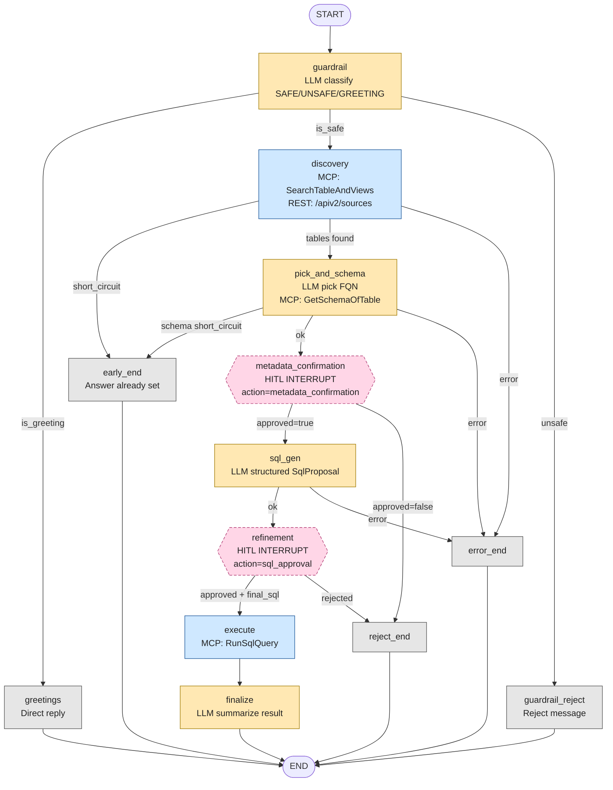
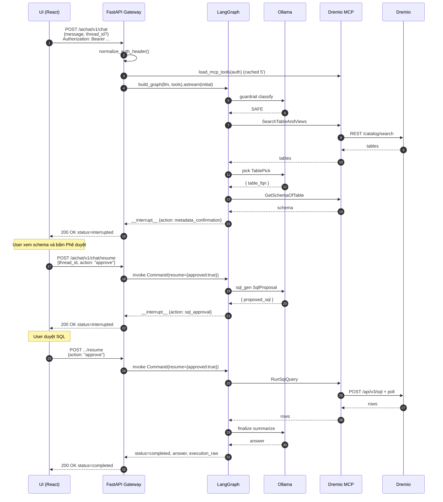

# Báo cáo: Xây dựng Backend Logic cho LLM (LangGraph)

Tài liệu trình bày phần **backend AI agent** của dự án `thesis` (nhánh `aichatbot-merge`) — chịu trách nhiệm xử lý câu hỏi tự nhiên của người dùng, gọi LLM, tương tác với Dremio thông qua MCP, sinh & thực thi SQL với **Human-in-the-loop (HITL)**.

---

## 1. Tổng quan

Backend được xây dựng quanh **LangGraph** — một thư viện điều phối **luồng tác tử (agentic flow)** dạng đồ thị có trạng thái (StateGraph). Mỗi nút là một bước xử lý (LLM call, MCP tool call, hoặc HITL pause), mỗi cạnh là một quyết định điều hướng dựa trên trạng thái.

Mục tiêu chính của backend:

1. **Phân loại an toàn** câu hỏi (guardrail) trước khi gọi LLM tốn kém.
2. **Khám phá metadata** trong Dremio: list source, search bảng/view, lấy schema cột.
3. **Sinh SQL** chỉ-đọc từ schema + ngôn ngữ tự nhiên.
4. **Tạm dừng (interrupt) chờ người dùng** phê duyệt metadata / SQL — đây là phần quan trọng nhất, giúp AI không "tự ý" chạy truy vấn nguy hiểm.
5. **Thực thi SQL** qua MCP và **tóm tắt** kết quả bằng LLM.

---

## 2. Thành phần & cấu trúc thư mục

Toàn bộ backend nằm trong `tools/dremio-mcp/`:

```text
tools/dremio-mcp/src/dremioai/
├── gateway/                    # FastAPI server (REST cho UI)
│   ├── app.py                  # Entry-point FastAPI, 3 endpoint /aichat/*
│   ├── config.py               # env, normalize_auth_header
│   ├── models.py               # Pydantic request/response
│   └── history.py              # (lưu lịch sử)
│
├── agent/                      # LangGraph agent
│   ├── graph.py                # build_graph(): wire nodes + edges, compile
│   ├── state.py                # AgentState (TypedDict — kho dữ liệu chung)
│   ├── tools.py                # locate MCP tools (search/schema/sql)
│   ├── mcp_client.py           # MultiServerMCPClient → Dremio MCP server
│   └── nodes/                  # 13 node + 5 router (conditional edges)
│       ├── common.py           # helpers, Pydantic schema (TablePick, SqlProposal)
│       ├── guardrail.py        # guardrail + greetings + reject + router
│       ├── discovery.py        # discovery + pick_and_schema + 2 router
│       └── sql_flow.py         # metadata_confirmation (HITL) + sql_gen
│                               #   + refinement (HITL) + execute + finalize
│                               #   + reject/error/early_end + 3 router
```

---

## 3. Ngăn xếp công nghệ

| Lớp | Thư viện | Vai trò |
|------|----------|---------|
| Web framework | **FastAPI** + **uvicorn** | Phơi 3 REST endpoint `/aichat/*` |
| Orchestration | **LangGraph** | Đồ thị trạng thái có HITL |
| LLM | **langchain-ollama** (`ChatOllama`) | Gọi Ollama local (mặc định `qwen3.5:4b`) |
| Structured output | **Pydantic** + `llm.with_structured_output` | Ép LLM trả về object có schema (`TablePick`, `SqlProposal`) |
| Tool protocol | **MCP** (Model Context Protocol) qua `langchain-mcp-adapters` | Kết nối Dremio MCP server (port 8080) |
| State persistence | **InMemorySaver** (LangGraph checkpointer) | Lưu trạng thái mỗi `thread_id` để resume sau HITL |
| HTTP client | **aiohttp** + **httpx** | Gọi REST Dremio `/apiv2/sources` trực tiếp |

---

## 4. Trạng thái dùng chung (`AgentState`)

Tất cả node đọc/ghi cùng một `TypedDict` — đây là **kho dữ liệu trung tâm** của agent:

```24:65:tools/dremio-mcp/src/dremioai/agent/state.py
class AgentState(TypedDict, total=False):
    user_question: str
    user_context: str | None
    dremio_auth_header: str | None
    discovery_short_circuit: bool

    # guardrail
    is_safe: bool
    is_greeting: bool
    guardrail_reason: str

    # discovery
    discover_result: str
    discovered_tables: list[dict[str, Any]]

    # metadata confirmation (HITL)
    table_fqn: str
    schema_text: str
    metadata_approved: bool
    schema_short_circuit: bool

    # SQL generation
    proposed_sql: str
    sql_rationale: str

    # refinement (HITL)
    sql_approved: bool
    final_sql: str

    # execution
    execution_raw: Any
    assistant_answer: str
    error: str | None
```

Mỗi node trả về một `dict[str, Any]` partial — LangGraph tự gộp vào state. Khóa quan trọng:

- **`assistant_answer`** — câu trả lời cuối cùng đẩy về UI.
- **`error`** — nếu khác `None`, đẩy graph rẽ sang `error_end`.
- **`*_short_circuit`** — flag cho "đường tắt": discovery có thể trả lời ngay (list sources, list tables) mà không cần đi qua HITL SQL.

---

## 5. Đồ thị LangGraph (Mermaid)

Sơ đồ chính thức của agent — **13 node + 8 cạnh điều kiện**:



> **Chú giải màu:** Vàng = node có gọi LLM. Xanh = node gọi MCP tool. Hồng (nét đứt) = HITL pause (interrupt). Xám = node kết thúc.

### Diễn giải luồng

1. **`guardrail`** chặn câu hỏi nguy hiểm hoặc chuyển câu chào sang phản hồi nhanh.
2. **`discovery`** tìm bảng/view trong Dremio. Một số ý định ngắn (list sources, list tables) sẽ **short-circuit** → trả lời ngay, không cần SQL.
3. **`pick_and_schema`** chọn đúng 1 bảng và lấy schema. Nếu user chỉ hỏi "mô tả cột" cũng short-circuit luôn.
4. **`metadata_confirmation`** **DỪNG** đợi user xem schema và bấm `Phê duyệt` / `Từ chối`.
5. **`sql_gen`** sinh 1 câu `SELECT` chỉ đọc, ép qua Pydantic `SqlProposal`.
6. **`refinement`** **DỪNG** lần 2 đợi user duyệt / sửa SQL.
7. **`execute`** chạy SQL qua MCP `RunSqlQuery`.
8. **`finalize`** dùng LLM tóm tắt kết quả thành tiếng Việt thân thiện.

---

## 6. Cấu hình graph (`graph.py`)

```64:120:tools/dremio-mcp/src/dremioai/agent/graph.py
def build_graph(llm: Any, mcp_tools: list[Any]) -> Any:
    g = StateGraph(AgentState)

    g.add_node("guardrail", make_guardrail_node(llm))
    g.add_node("greetings", make_greetings_node())
    g.add_node("guardrail_reject", make_guardrail_reject_node())
    g.add_node("discovery", make_discovery_node(mcp_tools))
    g.add_node("early_end", make_early_end_node())
    g.add_node("pick_and_schema", make_pick_and_schema_node(llm, mcp_tools))
    g.add_node("metadata_confirmation", make_metadata_confirmation_node())
    g.add_node("sql_gen", make_sql_gen_node(llm))
    g.add_node("refinement", make_refinement_node())
    g.add_node("execute", make_execute_node(mcp_tools))
    g.add_node("finalize", make_finalize_node(llm))
    g.add_node("reject_end", make_reject_node())
    g.add_node("error_end", make_error_node())

    g.add_edge(START, "guardrail")
    g.add_conditional_edges("guardrail", route_after_guardrail, {...})
    ...
    g.add_edge("execute", "finalize")
    g.add_edge("finalize", END)
    ...
    return g.compile(checkpointer=get_checkpointer())
```

Hai điểm đáng chú ý:

1. **Factory pattern** (`make_*_node`) — mỗi node là closure bắt sẵn `llm` và/hoặc `mcp_tools`. Giúp dễ test (mock 2 dependency) và **không có biến global**.
2. **`InMemorySaver`** làm checkpointer — bắt buộc để `interrupt()` hoạt động (LangGraph cần checkpoint mỗi node để resume sau).

---

## 7. Chi tiết từng node

### 7.1 `guardrail` — Phân loại ý định

Ba lớp lọc:

1. **Regex fast-path GREETING** — `hello/xin chào/...` → trả `is_greeting=True`.
2. **Regex fast-path DATA_SAFE** — chứa keyword `sql / bảng / schema / select / từ / where / phân tích / ...` → trả `is_safe=True` **không gọi LLM**.
3. Còn lại → gọi LLM với prompt:

   > "Classify the user message as GREETING, SAFE, or UNSAFE."

Tối ưu: **2 fast-path regex** giúp tránh 70-80% lần gọi LLM tốn ~1-3s. Quan trọng với UX vì backend chạy Ollama local có thể chậm.

### 7.2 `discovery` — Khám phá metadata

Logic phức tạp với **3 nhánh**:

| Nhánh | Khi nào | Hành động |
|-------|---------|-----------|
| **List sources** | Câu hỏi chứa "nguồn dữ liệu / data source" | Gọi REST Dremio `GET /apiv2/sources` bằng PAT của user. Fallback sang `INFORMATION_SCHEMA.SCHEMATA` qua MCP. **Short-circuit**. |
| **Multi-table catalog** | "liệt kê tất cả bảng / catalog" | Gọi MCP `SearchTableAndViews`, format danh sách → **short-circuit**. |
| **Single-table (mặc định)** | Câu hỏi phân tích cụ thể | Gọi `SearchTableAndViews` → trả `discovered_tables` cho `pick_and_schema`. |

Có fallback thông minh: nếu query rỗng, agent trích các **dataset token** (`NYC-taxi.csv`, `sales_2024`) từ câu gốc và thử search lại bằng từng token.

### 7.3 `pick_and_schema` — Chọn bảng + lấy schema

- Nếu `discovered_tables` chỉ có **1 hit** → bỏ qua LLM, dùng trực tiếp.
- Nhiều hit → LLM với `structured_output(TablePick)` chọn 1 FQN duy nhất.
- Gọi MCP `GetSchemaOfTable` lấy cột, kiểu dữ liệu.
- Nếu user chỉ hỏi "mô tả cột" → format Markdown ngay (`_format_schema_description_answer`), **short-circuit**.

`TablePick` là Pydantic model:

```108:115:tools/dremio-mcp/src/dremioai/agent/nodes/common.py
class TablePick(BaseModel):
    table_fqn: str = Field(...,
        description='Fully-qualified Dremio identifier, e.g. "source"."folder"."table"')
    rationale: str = Field(default="", description="Why this table matches...")
```

### 7.4 `metadata_confirmation` — HITL pause #1

Đây là **trái tim của HITL**. Node gọi `interrupt(payload)` — LangGraph **đóng băng** graph, lưu checkpoint, trả về luôn cho FastAPI:

```24:67:tools/dremio-mcp/src/dremioai/agent/nodes/sql_flow.py
def make_metadata_confirmation_node():
    def metadata_confirmation_node(state: AgentState) -> dict[str, Any]:
        ...
        payload = {
            "action": "metadata_confirmation",
            "message": "Review discovered tables and schema before SQL generation.",
            "table_fqn": state.get("table_fqn"),
            "schema_text": (state.get("schema_text") or "")[:4000],
            "discover_excerpt": (state.get("discover_result") or "")[:4000],
        }
        raw: Any = interrupt(payload)

        approved = False
        if isinstance(raw, dict):
            approved = bool(raw.get("approved", raw.get("approve", False)))
        elif isinstance(raw, bool):
            approved = raw
        return {"metadata_approved": approved}

    return metadata_confirmation_node
```

FastAPI bắt `__interrupt__` chunk, trả response `status=interrupted` về cho UI. Khi user bấm "Phê duyệt" trên UI, request `POST /aichat/v1/chat/resume` đến với `Command(resume={"approved": True})` — LangGraph **load checkpoint**, chạy tiếp từ chính node này.

### 7.5 `sql_gen` — Sinh SQL

LLM với prompt cứng:

> "Write one Dremio SQL SELECT for the user question. Use only tables/columns from the schema JSON. Prefer LIMIT 100 for exploration. **No DML.**"

Trả `SqlProposal` (Pydantic). Có **guard cuối**: nếu LLM lỡ trả lời không phải `SELECT/WITH` → fallback `SELECT * FROM <fqn> LIMIT 10`.

### 7.6 `refinement` — HITL pause #2

Tương tự `metadata_confirmation` nhưng cho SQL. User có thể:

- **approve** → chạy SQL gốc.
- **edit** → gửi `{"approved": True, "sql": "<edited>"}` — node lấy SQL người dùng đã sửa.
- **reject** → đi `reject_end`.

```151:167:tools/dremio-mcp/src/dremioai/agent/nodes/sql_flow.py
raw: Any = interrupt(payload)

approved = False
override: str | None = None
if isinstance(raw, dict):
    approved = bool(raw.get("approved", raw.get("approve", False)))
    override = raw.get("sql") or raw.get("edited_sql") or raw.get("sql_override")
elif isinstance(raw, bool):
    approved = raw

final_sql = (override or state.get("proposed_sql") or "").strip()
return {"sql_approved": approved, "final_sql": final_sql}
```

### 7.7 `execute` & `finalize`

- `execute` gọi MCP `RunSqlQuery` (`sql_tool.ainvoke({"query": state["final_sql"]})`).
- `finalize` cho LLM tóm tắt JSON kết quả (cắt 8000 ký tự) thành câu trả lời tiếng Việt.

Nếu node trước đã set `assistant_answer` (short-circuit) thì `finalize` no-op.

---

## 8. Cổng giao tiếp UI ↔ Agent (FastAPI Gateway)

Gateway `gateway/app.py` phơi 3 endpoint dưới prefix `/aichat/`:

| Endpoint | Method | Mô tả |
|----------|--------|-------|
| `/aichat/health` | GET | Health check |
| `/aichat/v1/config` | GET | Config: `default_model`, `mcp_configured` |
| `/aichat/v1/chat` | POST | **Bắt đầu** hội thoại — build graph + invoke |
| `/aichat/v1/chat/resume` | POST | **Resume** sau HITL |

### Vòng đời 1 request đầy đủ



### Cách stream + thu thập interrupt

LangGraph có 2 chế độ stream: `values` chỉ phát state cuối nên **không thấy** `__interrupt__`. Code chọn `updates` rồi tự gộp:

```93:127:tools/dremio-mcp/src/dremioai/gateway/app.py
async def _graph_astream_collect(
    graph: Any, payload: Any, config: dict[str, Any]
) -> dict[str, Any]:
    accum: dict[str, Any] = {}
    interrupt_val: Any = None
    async for chunk in graph.astream(payload, config=config, stream_mode="updates"):
        if not isinstance(chunk, dict):
            continue
        intr = chunk.get("__interrupt__")
        if intr:
            interrupt_val = intr
        for key, val in chunk.items():
            if key == "__interrupt__":
                continue
            if isinstance(val, dict):
                accum.update(val)
            else:
                accum[key] = val
    out = dict(accum)
    if interrupt_val is not None:
        out["__interrupt__"] = interrupt_val
    return out
```

Hàm `_result_to_response` map thành 3 trạng thái UI: `interrupted | completed | error`.

---

## 9. Tích hợp MCP (Model Context Protocol)

`mcp_client.py` dùng `MultiServerMCPClient` (langchain-mcp-adapters) kết nối Dremio MCP server qua **HTTP-SSE** ở `DREMIO_MCP_URL=http://127.0.0.1:8080/mcp/`.

Auth: **Bearer PAT của user** được truyền nguyên xi qua MCP — đảm bảo agent **chỉ thấy dữ liệu user có quyền** (không leo thang quyền).

3 tool MCP chính được map:

| Tên MCP | Helper Python | Dùng ở node |
|---------|---------------|-------------|
| `SearchTableAndViews` | `get_search_tool()` | `discovery` |
| `GetSchemaOfTable` | `get_schema_tool()` | `pick_and_schema` |
| `RunSqlQuery` | `get_sql_tool()` | `discovery` (list sources), `execute` |

Có **cache 5 phút** cho danh sách tool theo PAT để tránh handshake lặp lại.

---

## 10. LLM (Ollama) & Structured Output

Mặc định model là **`qwen3.5:4b`** trên Ollama local. Có thể đổi qua `OLLAMA_MODEL`, `OLLAMA_BASE_URL`.

```65:81:tools/dremio-mcp/src/dremioai/gateway/app.py
def _build_llm(model_name: str | None = None, temperature: float = 0.0) -> Any:
    model = model_name or env("OLLAMA_MODEL", DEFAULT_OLLAMA_MODEL)
    base = env("OLLAMA_BASE_URL", "http://127.0.0.1:11434")
    stream_on = env("OLLAMA_STREAM", "false").strip().lower() in ("1","true","yes","on")
    cache_key = f"{model}|{base}|{temperature}|{stream_on}"
    if cache_key in _llm_cache:
        return _llm_cache[cache_key]
    llm = ChatOllama(model=model, base_url=base, temperature=temperature)
    result = llm if stream_on else llm.bind(stream=False)
    _llm_cache[cache_key] = result
    return result
```

Đặc trưng:

- **`stream=False` mặc định** — Qwen "thinking build" có thể hang khi stream SSE.
- **Cache LLM instance** theo `(model, base, temperature, stream)`.
- **Structured output** dùng `llm.with_structured_output(Pydantic)` cho 2 chỗ:
  - `TablePick` ở `pick_and_schema`
  - `SqlProposal` ở `sql_gen`

Có **timeout cho structured call** (`AGENT_STRUCTURED_LLM_TIMEOUT_SECONDS`, mặc định 120s) — nếu model treo, agent fail-fast.

---

## 11. Cấu hình môi trường

| Biến | Mặc định | Vai trò |
|------|----------|---------|
| `OLLAMA_MODEL` | `qwen3.5:4b` | Model LLM |
| `OLLAMA_BASE_URL` | `http://127.0.0.1:11434` | Ollama endpoint |
| `OLLAMA_STREAM` | `false` | Bật/tắt SSE stream Ollama |
| `DREMIO_MCP_URL` | `http://127.0.0.1:8080/mcp/` | Dremio MCP HTTP |
| `DREMIO_MCP_TIMEOUT_SECONDS` | `120` | HTTP timeout MCP |
| `DREMIO_MCP_SSE_READ_TIMEOUT_SECONDS` | `7200` | SSE read timeout |
| `DREMIO_MCP_TOOLS_CACHE_TTL` | `300` | TTL cache tool list (s) |
| `AGENT_REQUEST_TIMEOUT_SECONDS` | – | Cap tổng cho 1 request (s) |
| `AGENT_STRUCTURED_LLM_TIMEOUT_SECONDS` | `120` | Cap cho `with_structured_output` |
| `AGENT_TRACE_LOG` | `1` | Log node-level |
| `AGENT_TRACE_VERBOSE` | `1` | Log prompt chars |
| `AGENT_TRACE_LLM_CONTENT` | `0` | Log nội dung prompt (debug) |
| `AGENT_MULTI_TABLE_SHORT_CIRCUIT` | `1` | Bật short-circuit list catalog |
| `GATEWAY_HOST` / `GATEWAY_PORT` | `127.0.0.1` / `9292` | Bind gateway |

---

## 12. Các đường tắt (short-circuit) trong graph

Để giảm latency và số round-trip, graph hỗ trợ 4 nhánh tắt — không cần đi qua HITL:

| Cờ | Nguồn | Hành động |
|----|-------|-----------|
| `is_greeting=True` | regex ở `guardrail` | `→ greetings → END` |
| `discovery_short_circuit=True` | `discovery` đã trả được câu trả lời (list sources / catalog) | `→ early_end → END` |
| `schema_short_circuit=True` | user chỉ hỏi "mô tả cột" | `→ early_end → END` |
| (không cờ) | guardrail nói UNSAFE | `→ guardrail_reject → END` |

Mục tiêu: chỉ những câu hỏi **thực sự cần SQL** mới chạy đầy đủ 2 vòng HITL.

---

## 13. Logging & quan sát

3 cấp log:

1. **`_trace`** — log node-level (`step=guardrail done greeting=...`).
2. **`_trace_verbose`** — kích thước prompt, response, preview.
3. **`agent_debug_ndjson`** — NDJSON cho experiment "hypothesis-driven" (H1..H9) ghi vào file local; phục vụ debug hành vi LLM.

Mọi log có prefix `[agent]` → dễ filter bằng `grep`.

---

## 14. Bảo mật

| Cơ chế | Ghi chú |
|--------|---------|
| Auth từ UI | Bearer PAT/JWT, **bắt buộc** ở `/aichat/v1/chat*` |
| Pass-through PAT đến MCP | Đảm bảo phân quyền do Dremio kiểm soát, agent **không có quyền siêu** |
| **No DML/DDL** | Prompt cứng buộc `SELECT`; ngoài ra `sql_gen` fallback `SELECT * LIMIT 10` nếu LLM trả về khác |
| HITL bắt buộc | Mỗi SQL **phải qua 2 vòng phê duyệt** trước khi chạy |
| Guardrail | Regex + LLM lọc câu UNSAFE / prompt injection |
| Timeout layer | Per-LLM-call + per-request → tránh "ngốn tài nguyên" |

---

## 15. Đánh giá

### Ưu điểm

1. **Đồ thị tường minh** — tách rõ 13 node, mỗi node 1 việc, dễ test/maintain.
2. **HITL đúng nghĩa** — dùng đúng cơ chế `interrupt()` + `Command(resume=...)` của LangGraph, không tự chế.
3. **Stateless gateway** — checkpointer in-memory đủ cho 1 instance; có thể đổi sang Redis/Postgres saver để scale ngang.
4. **Defensive coding** — nhiều regex fast-path, fallback search, parser tolerant với cả `str` / `dict` / `list` từ MCP.
5. **Đa luồng tắt** — UX nhanh cho 4 trường hợp phổ biến.
6. **Mở rộng dễ** — thêm node mới chỉ cần `g.add_node` + 1 edge.

### Hạn chế / hướng cải thiện

1. **Checkpointer `InMemorySaver`** — mất state khi restart gateway; cần `PostgresSaver` cho production.
2. **`build_graph` mỗi request** — tốn ~10-50ms; có thể cache theo `(model, mcp_tools_hash)`.
3. **Không streaming token về UI** — UI phải đợi cả response; có thể đổi sang SSE để render dần.
4. **Hard-coded prompts tiếng Anh + 1 model** — chưa có abstraction cho multi-provider (OpenAI, Anthropic).
5. **`_AGENT_DEBUG_LOG_PATH` tuyệt đối** (`/home/djuybu/...`) — không portable; nên dùng env.
6. **Guardrail regex tiếng Việt rất to** — có thể tách ra file YAML để dễ chỉnh.
7. **Thiếu test integration end-to-end** — chỉ có test đơn vị từng node (trong `tests/`).

---

## 16. Tham chiếu nhanh

| File | Vai trò |
|------|---------|
| `tools/dremio-mcp/src/dremioai/agent/graph.py` | Build & compile StateGraph |
| `tools/dremio-mcp/src/dremioai/agent/state.py` | Định nghĩa `AgentState` |
| `tools/dremio-mcp/src/dremioai/agent/nodes/guardrail.py` | Guardrail + greetings |
| `tools/dremio-mcp/src/dremioai/agent/nodes/discovery.py` | Discovery + pick_and_schema |
| `tools/dremio-mcp/src/dremioai/agent/nodes/sql_flow.py` | metadata_confirmation, sql_gen, refinement, execute, finalize |
| `tools/dremio-mcp/src/dremioai/agent/nodes/common.py` | Pydantic models, helpers |
| `tools/dremio-mcp/src/dremioai/agent/tools.py` | MCP tool locator |
| `tools/dremio-mcp/src/dremioai/agent/mcp_client.py` | MultiServerMCPClient |
| `tools/dremio-mcp/src/dremioai/gateway/app.py` | FastAPI gateway |
| `tools/dremio-mcp/docs/architecture.md` | Tài liệu kiến trúc |
| `tools/dremio-mcp/docs/api-spec.md` | API spec cho UI |
