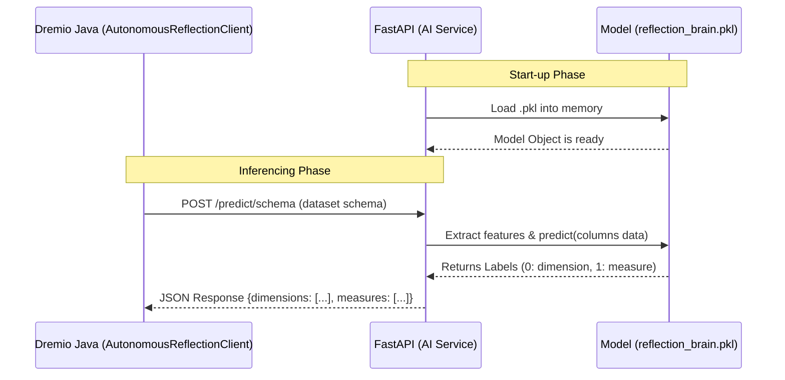

# Autonomous Reflection AI Service

Microservice này phục vụ việc suy luận Machine Learning cho Dremio, giúp tự động gán nhãn `dimension` (chiều) hoặc `measure` (thước đo) cho các cột trong một bảng dữ liệu.

## Kiến trúc phần mềm & Sơ đồ hoạt động

Service được thiết kế dưới dạng stateless REST API sử dụng `FastAPI`. Mô hình ML (`reflection_brain.pkl`) chỉ được load lên bộ nhớ (RAM) một lần duy nhất vào lúc start-up (cơ chế lifespan của FastAPI) để đảm bảo độ trễ thấp nhất trong quá trình Dremio thực hiện query schema.



## Các Endpoints (Danh sách API)

### 1. Phân loại cột trong tập dữ liệu
Trích xuất những cột có tiềm năng làm `Dimension` hoặc `Measure` dựa vào metadata.

**Endpoint:** `POST /predict/schema`

**Request Body (JSON):**
```json
{
  "datasetPath": ["space_name", "folder", "table"],
  "columns": [
    {
      "name": "id",
      "type": "VARCHAR",
      "uniqueCount": 1000000,
      "datatype_category": "categorical" 
    },
    {
      "name": "total_revenue",
      "type": "DOUBLE",
      "uniqueCount": 50000,
      "datatype_category": "numerical"
    }
  ]
}
```

**Response Body (JSON):**
```json
{
  "datasetPath": ["space_name", "folder", "table"],
  "dimensions": ["id"],
  "measures": ["total_revenue"]
}
```

### 2. Kiểm tra sức khoẻ (Health Check)
Được Dremio dùng để kiểm tra việc có thể reach tới AI model không trước khi request tính năng Autonomous.

**Endpoint:** `GET /health`

**Response Body (JSON):**
```json
{
  "status": "up",
  "model_loaded": true
}
```

## Hướng dẫn cài đặt

1. Install dependencies:
```bash
pip install -r requirements.txt
```

2. Run service:
```bash
uvicorn main:app --host 0.0.0.0 --port 8000 --reload
```
